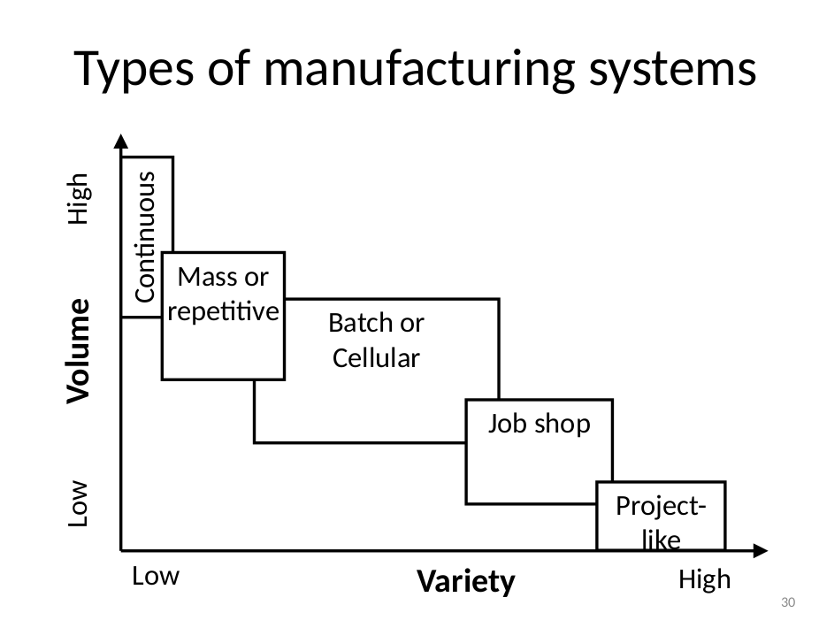

# Lecture 1 - Introduction to Production Systems

* **Classroom:** gsshftx
* **Software:** [SweetHome3D](https://www.sweethome3d.com/) (used for design and layout visualization)

## What is a Production System?

A **production system** is a network of **workstations** that work together to transform inputs into outputs. These workstations can take different forms, such as:
- **Assembly areas** (where different components are put together)
- **Machines** (performing specific tasks or operations)

The production system, conceptually, is similar to a **control system** that involves:
- **Inputs**: Materials, workers, energy, etc.
- **Processes**: Operations, transformations, activities
- **Outputs**: Goods or services

The **customer feedback** plays a role similar to the feedback loop in control systems, influencing the system’s adjustments and improvements.

> **Side note**: A real-world example is a car manufacturing plant, where inputs (raw materials like metal and plastic, human labor, and power) go through processes (assembly, painting, testing) to produce the output (a finished car). Customer feedback (quality reviews, complaints) helps the company improve its processes.

## Design of Production Systems

Designing a production system is a **project** on its own, requiring careful planning and resource allocation. 

## Types of Production System Design Projects

1. **New Facility**: Designing a completely new production facility from the ground up.
2. **New Production**: Introducing a new product and designing the system to produce it.
3. **Design Changes**: Modifying an existing system to improve performance or accommodate new requirements.
4. **Cost Reduction**: Redesigning an existing project to reduce costs without compromising on quality.
5. **Retrofit**: Designing a new facility but under constraints, such as limited space or the need to reuse existing equipment.

## Volume versus Variety

Production systems can be classified based on **volume** (the number of items produced) and **variety** (the range of different products).

- **High variety, low volume**: When a company produces many different products but in smaller quantities.
- **Low variety, high volume**: When a company produces a large quantity of a few types of products, often using automation to increase efficiency.

> **Example**: 
> - A **college workshop** can produce different components (e.g., bolts) but at a low production rate (high variety, low volume).
> - A **press machine** in a factory can produce a high number of bolts in a short time, but it can only produce bolts (low variety, high volume).

**Note**: Research "customized mass production" for methods to increase both variety and volume simultaneously.

## Types of Manufacturing Systems

1. **Continuous Production**: Used in processes that run without interruption, such as chemical reactions or steel rod production (high volume, low variety).
   - Example: Steel mills where production doesn’t stop, producing large quantities of uniform products.
   
2. **Project-based Production**: Customizes products for individual customers, such as shipbuilding or plane manufacturing (low volume, high variety).
   
3. **Mass or Repetitive Production**: Standardized production with minimal variation, often highly automated.
   - Example: Car assembly lines where the same product is made repeatedly.

4. **Job Shop**: A setup with a variety of general-purpose machines, capable of producing small quantities of customized products.
   - Example: A college workshop where many different items are produced in small numbers.

5. **Batch or Cellular Production**: Produces a group of items (batch) at a time, often used in clothing factories where different designs are made in different batches. 
   - It involves machines designed to produce a **family of products** (items with similar design but slight variations).

