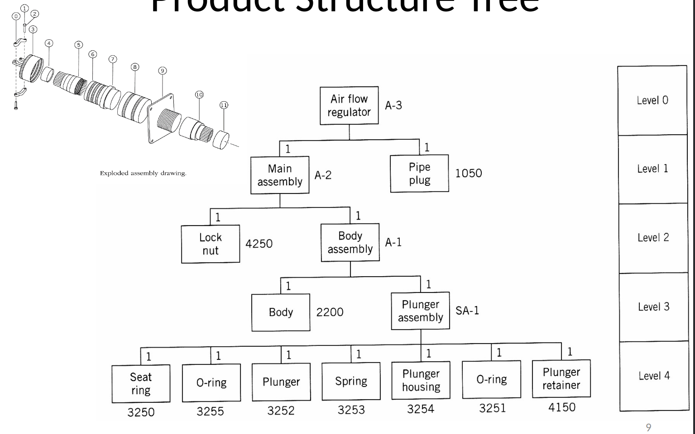
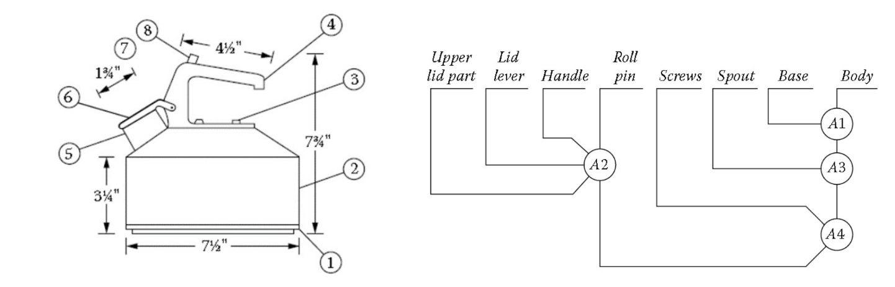
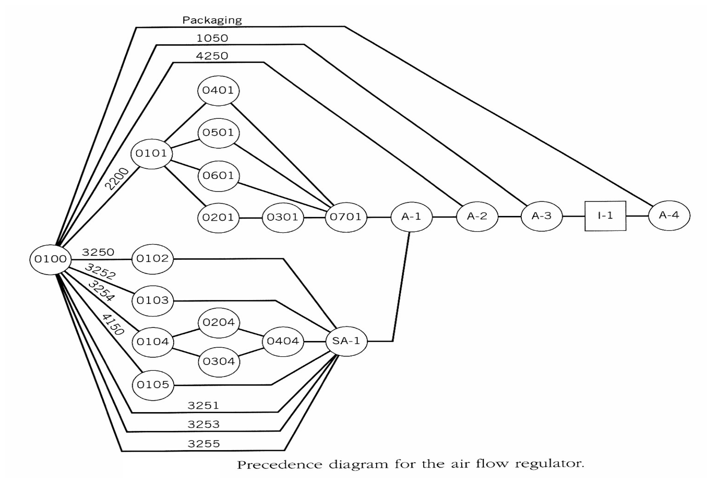
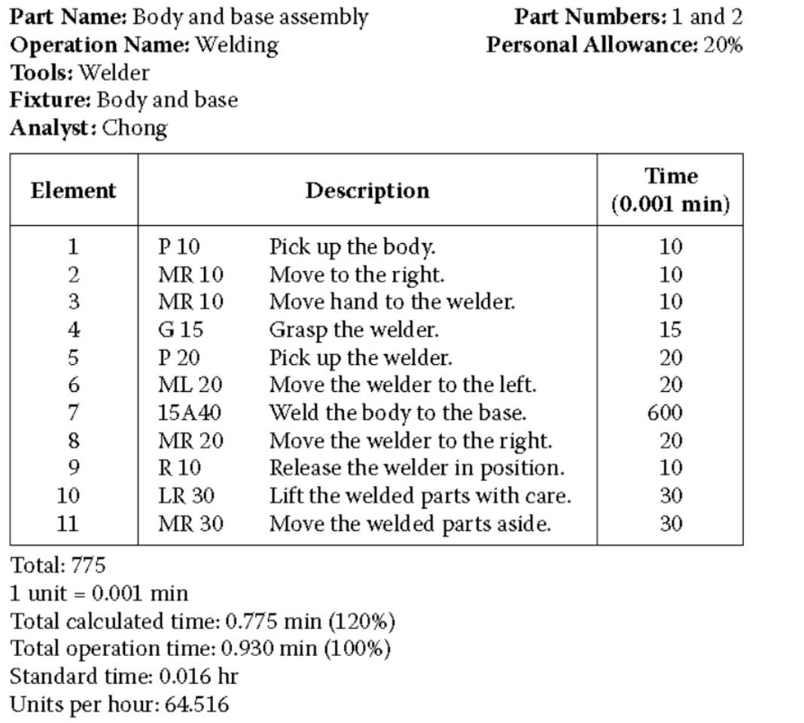

# Lecture 2 - Process Design

**Process design** involves selecting the appropriate production method for manufacturing a product. We must consider both **variety** and **volume** of production when deciding how to produce the product.

> **Example**: 
> - For **low volume**, we might use casting (a versatile but slow process).
> - For **high volume**, we can use a press machine (faster but less flexible).

In process design, we do the following:
1. **Choose the processes** required for production.
2. **Determine the sequence** in which these processes will be performed.

To achieve this, we use several tools:

## Product Drawing

A **product drawing** is useful for extracting key information about the product, such as:
1. **Dimensions**: Precise measurements of the product.
2. **Material**: The type of material needed for production.
3. **Fits and Tolerances**: Specifications for how components fit together and allowable variations.

> **What if we don’t have a product drawing?**
> In such cases, we use **reverse engineering** to recreate the drawing by analyzing the product itself.

## Product Assembly

Once we have the assembly information, we perform the following:

### 1. Product Structure Tree
- The product structure tree visually represents the final product and all its components.
- At the top level (level 0) is the **final product**. From there, we break down the sub-assemblies, and further break them down into individual components until we reach the **main parts** at the lowest level.
- Each level of the tree is represented by triangles containing the components, and they are coded for reference.

> **Note**: The tree helps us understand the hierarchy of parts, sub-assemblies, and the final product.

### 2. Bill of Materials (BOM)
- A **Bill of Materials** is a table that describes the product structure in detail. It lists all parts, components, and assemblies, along with quantities and descriptions.

## Production Charts

Production charts are tools that describe the production process using standardized symbols:
- **O** → Operation
- **→** → Transportation
- **□** → Inspection
- **D** → Delay
- **Flopped triangle** → Storage

### 1. Assembly Chart
This chart shows only the **assembly operations** and the order in which they are performed. It represents how different components are brought together to form the final product.

> **Example**:  
> 

 
The chart shows the predecessors for each assembly operation, indicating dependencies between steps.

### 2. Operation Process Chart
An operation process chart expands on the assembly chart by adding details of the specific processes involved. It shows not just how components are assembled but also the operations performed at each step.

### 3. Precedence Chart
Unlike the operation process chart, which lists operations, the precedence chart explicitly shows the **dependencies** between operations. It looks similar to an **Activity-on-Node (AON)** chart used in project management.

## Time Estimates

**Why is time estimation important?**  
Time estimates are crucial for calculating production volume and efficiency. 

There are several methods for estimating time:
1. **Time study for manual operations**: Observing workers and calculating time.
2. **Experience and historical records**: Using data from similar past projects.
3. **Mechanical process analysis**: Calculating time based on the mechanical properties of the process (e.g., formulas from metal cutting processes).
4. **Standard machine formulas**: Using established tables or formulas to estimate time for machines.

> **Example**: In a time study, we break down the movements of operators, calculate the time for each movement, and add tolerances. This is called a **time study**.
>

## Routing Sheet

A **routing sheet** describes the following for each process:
- **Machines needed** (tools that need to be purchased)
- **Estimated setup times** for the machines
- **Production rate** (in units/hour)

> **Note**: 
> - Setup time differs from operation time. **Setup time** refers to the time needed to prepare the machine, which may be done once for a batch, whereas **operation time** is the time taken for the actual operation on each unit.

## Machine Selection

When selecting machines, we need to consider:
- Types of machines available for the required manufacturing operations.
- Suppliers/sellers of machine tools.
- Costs of machines.
- Machine throughput and other technical specifications.

> **Where can we obtain this information?**
> 
> - Online equipment sellers like:
>   - [MachineTools](https://www.machinetools.com)
>   - [Alibaba](https://www.alibaba.com)
>   - [HACO](https://www.haco.com/en)

## Quick Notes

Refer to the lecture slides for more detailed information (additional search may be necessary for full understanding).

### Types of Manufacturing Processes

1. **Changing material shape** (e.g., forging, casting)
2. **Machining parts to fixed dimensions** (e.g., milling, drilling)
3. **Obtaining surface finish** (e.g., polishing)
4. **Joining parts** (e.g., welding)
5. **Changing physical properties** (e.g., heat treatment)
6. **Plastic processing** (covered in more detail below)

### Plastic Processing (Molding)
- **Compression Molding**
- **Injection Molding**
- **Rotary Molding**
- **Blow Molding**
- **Extrusion**
- **Thermoforming**
