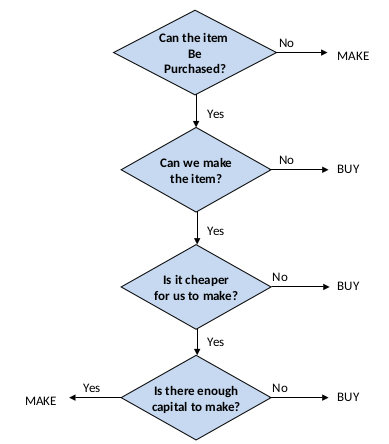
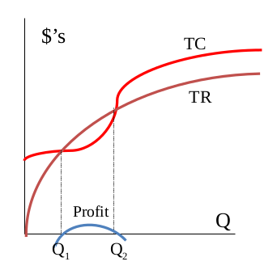
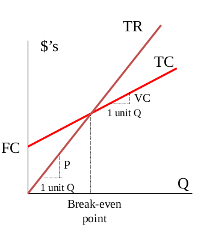
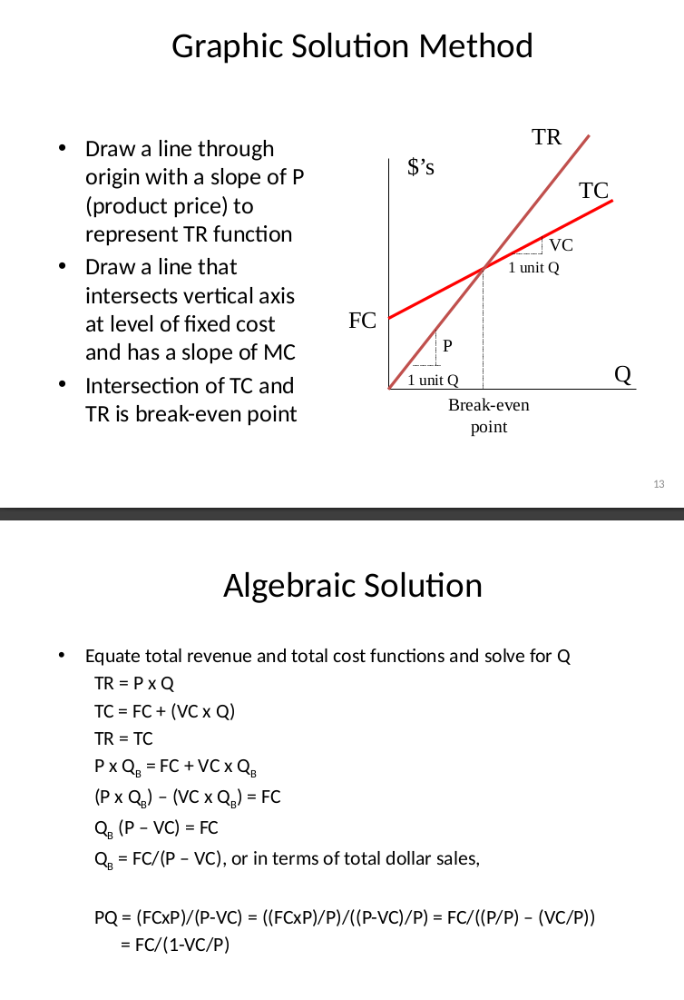

# Lecture 3 - Make-or-Buy Decisions and Break-Even Analysis

## Make-or-Buy Decision

To decide, follow the following chart:

### Make or Buy Analysis:

**Cost elements in the make decision:**
1. Delivered purchased material costs
2. Direct labor costs
3. Inventory carrying costs
4. Factory overhead costs

**Cost elements in the buy decision:**
1. Purchase price of the part
2. Transportation costs
3. Receiving and inspection costs
4. Incremental purchasing costs (e.g., buying more than needed due to offers)
5. Any follow-on cost related to quality or service

We use the **variable** and **fixed costs** when deciding to make or buy.

## The Break-Even Analysis

Break-even analysis helps estimate which decision (make or buy) is better. In the following charts (representing **total cost** and **total revenue**), if total revenue exceeds total cost, there is profit. The intersection is the **break-even point**.

We perform the analysis for both the "buy" and "make" options. The **x-axis** represents quantity, and the **y-axis** represents money.

Most of the time, we use a **linear break-even analysis** as an assumption for a small range of output levels for TR (Total Revenue) and TC (Total Cost). By assuming linearity, we make the following assumptions:

* Constant selling price
* Constant marginal cost (the variable cost)
* Firm produces only one product
* No time lags between investment and resulting revenue stream

Using this **linear assumption**, we will have only **one point of intersection** in the break-even graph.

Using this algebraic analysis, we can calculate the break-even point.  
**(Explanation needed from the next slide):**

**For ChatGPT:** Please explain what is the PQ.

## Related Concepts

* **Profit contribution** = P - VC  
  The amount per unit of sale that contributes to fixed costs and profit.
* **Target volume** = (FC + Profit) / (P - VC)  
  The output level at which a targeted total profit would be achieved.

## Notes on Example: How many famous Ramadan lanterns need to be sold?
* **FC** is the fixed cost
* The **profit** is the target profit
* The **P** is the selling price (slope of the break-even point)
* **VC** is the variable cost

Using the equation for target volume:  
$$Target volume = \frac{FC + Profit}{P - VC}$$ 
Now, you can calculate the volume needed to sell to achieve the target profit.
______________________________________________________

Complete the rest of the lecture notes another time because  
أنا خلاص مش قادر
