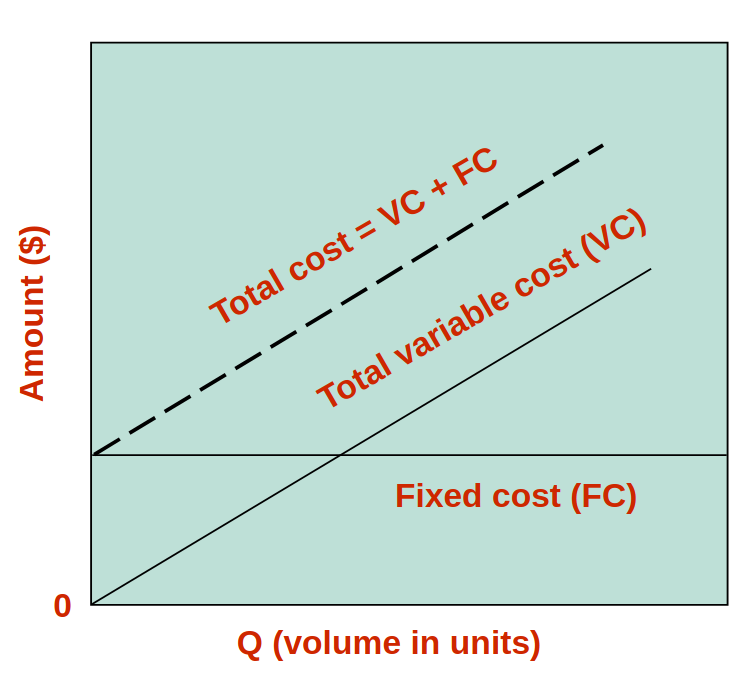
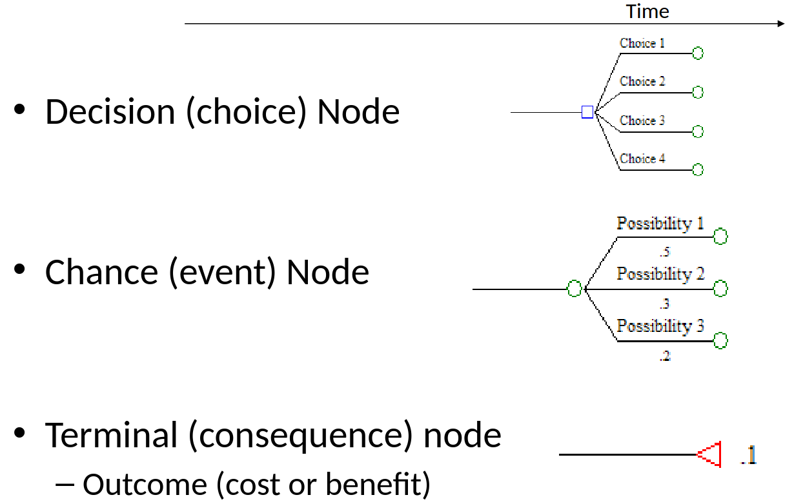

# Lecture 4 - Capacity Analysis

To plan for capacity, we need to do the following:
* Know the volume of the demand in the market
  * By ensuring there is a gap between demand and supply (from the Chamber of Commerce)
  * Obtain statistics (CAPSCU)

**Capacity**: The `throughput` or the number of units a facility can produce in a period of time.

### Uses of Capacity:
* Determines the fixed costs (e.g., machines to buy)
* Determines how much of the demand will be satisfied
* Includes three planning horizons:
  * **Long-range** (5 to 10 years)
  * **Intermediate-range** (up to 2 years)
  * **Operational level** (1 day to 3 months)

### Types of Capacity:
* **Design capacity**: The maximum output a machine can theoretically produce (may not be fully utilized due to setup or maintenance time)
* **Effective capacity**: 
  * The maximum output that can be produced by the machine after accounting for setup time, maintenance, and other constraints
  * Always less than design capacity

## Utilization and Efficiency

**Utilization**: The percentage of design capacity actually achieved. It indicates how much of the design capacity is used.

$$Utilization = \frac{Actual Output}{Design Capacity}$$

**Efficiency**: The percentage of effective capacity achieved.

$$Efficiency = \frac{Actual Output}{Effective Capacity}$$

## Capacity Planning Challenges

* Inability to create a steady flow of demand to fully utilize capacity
* Demand fluctuates and varies
* **Idle capacity** is a reality  
  **(Prompt to ChatGPT: What does this mean?)**

## Capacity Planning Over a Time Horizon

* **Long-range**: Add facilities or new equipment
* **Intermediate-range**: Subcontract production, add more shifts
* **Short-range**: Short-term operational changes

## Demand
### Possible Patterns:
* Growth
* Decline
* Cyclical
* Stable

### Case 1: Demand Exceeds Capacity
* Curtail demand (e.g., by raising prices)
* Long-term solution: Increase capacity

### Case 2: Capacity Exceeds Demand
* Stimulate the market (e.g., marketing)
* Product changes to better fit demand

### Case 3: Adjusting Seasonal Demands
* Produce products with **complementary demand patterns**  
  **(Prompt to ChatGPT: What does this mean?)**

## Capacity Considerations

* Accurately forecast demand
* Understand technology and capacity increments
* Find the optimal operating level (volume)
* Build for change (plan with flexibility in mind)

## Approaches to Capacity Expansion

* **Demand leads capacity expansion**: Capacity increases to match demand
* **Capacity leads demand**: Capacity is expanded one step ahead of demand
* **Capacity lags demand**: Capacity is slightly less than demand but attempts to keep up
* **Proactive approach**: Increase capacity beyond demand and wait for demand to catch up, then increase capacity again

## Cost-Volume Relationships

## Decision Tree Analysis

It contains:
* **Decision node**: Represents a choice
* **Chance node**: Represents an event
* **Terminal node**: Represents a consequence (outcome, benefit, or cost)

**Example**:

### Types of Decision-Making:
* **Risk**: Making decisions under uncertainty
* **Conservative**: Taking the safest option
* **Rational**: Using logic and analysis (the approach we use)
