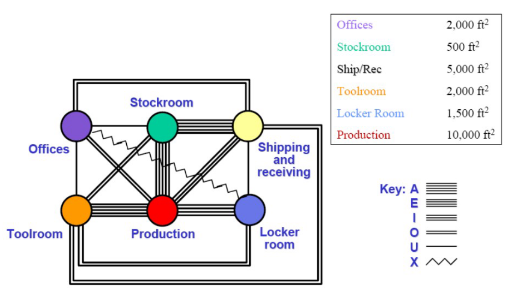

# Lecture 6 - Facility Layout Planning

## Input Data to Facility Layout Planning

To plan the facility layout effectively, the following inputs are required:
* Selected type of production system
* Available space for the production system
* Selected machines and their numbers
* Selected material handling equipment and their numbers
* Number of direct laborers
* Material flow patterns
* Material flow rates

---

## Space Requirements

Space planning is one of the most challenging aspects due to the high level of uncertainty. Factors include:
* **Technological changes**: Future expansions may require updated equipment.
* **Demand forecasts**: Subject to frequent fluctuations.
* **Changing product mix**: The variety of products may increase or shift over time.
* **Parkinson's Law**: Allocated space will be used entirely, whether necessary or not. Therefore, designs should optimize for worker movements and material handling.
* **New designs**: Innovations in product design may require layout modifications.

---

## Design Approach

Facility layouts follow a **bottom-up approach**, starting from workspace design and progressing to the entire facility.

### Workstation Space Design
Key considerations:
1. **Equipment Footprint**:
   * Machine travel
   * Machine maintenance
   * Plant services (**Prompt to ChatGPT: What does it mean?**)
2. **Material Handling**:
   * **Inbound and storage**: Space for receiving and storing raw materials.
   * **In-process**: Space for materials currently being processed.
   * **Outbound**: Space for finished goods ready for shipping (**Prompt to ChatGPT: What is it?**).
   * **Waste and scrap**: Allocate space for discarded materials.
   * **Tools and fixtures**
3. **Personnel**:
   * Operator workspace
   * Material handling activities
   * **Ingress/egress** (**Prompt to ChatGPT: What does it mean?**)

**Example Diagram**:

---

### Departmental Space Area

To calculate this:
1. Add aisle allowances to the sum of workstation areas.
2. Determine aisle space based on the maximum load area that moves between workstations.
3. Use tools such as departmental service requirement sheets, which compile data on equipment, materials, operators, and area requirements, and add aisle allowances.

**Reference Table for Aisle Planning**:

---

### Aisle Planning

Purpose: Facilitate smooth material and personnel flow.  
**Types**:
* **Departmental Aisles**
* **Main Aisles** (**Prompt to ChatGPT: What is the difference?**)

**Tradeoff**: Balancing congestion and wasted space.  
**Principles**:
* Avoid curves and non-right-angle intersections.
* Aisles should be straight and lead to doors.
* Avoid aisles along the outer walls unless for entry/exit to minimize wasted space.
* Consider column spacing when planning aisle layouts.

**Aisle Width**: Typically standardized.

---

### Personnel Space Requirements

Personnel areas to include:
1. Employee/Facility Interface
2. Restrooms
3. Food Services
4. Health Services
5. Barrier-Free Compliance (accessibility)
6. Office Planning

**Example of Personnel Space Areas**:

---

## Space Relationship Diagram

1. **Activity Relationship Chart**: A chart detailing relationships between activities.
   
2. **Relationship Diagram**:
   * Use parallel lines to express the necessity of relationships between workspaces.
   
   * Reorder workspaces to meet requirements.
   
3. **Apply Area to Scale**:
   * Convert the diagram into a scaled representation of the space.
   

---

## Muther's Systematic Layout Planning (SLP)

SLP provides a systematic methodology for layout design. It follows a structured flowchart to achieve optimal layouts.

**Flowcharts**:

