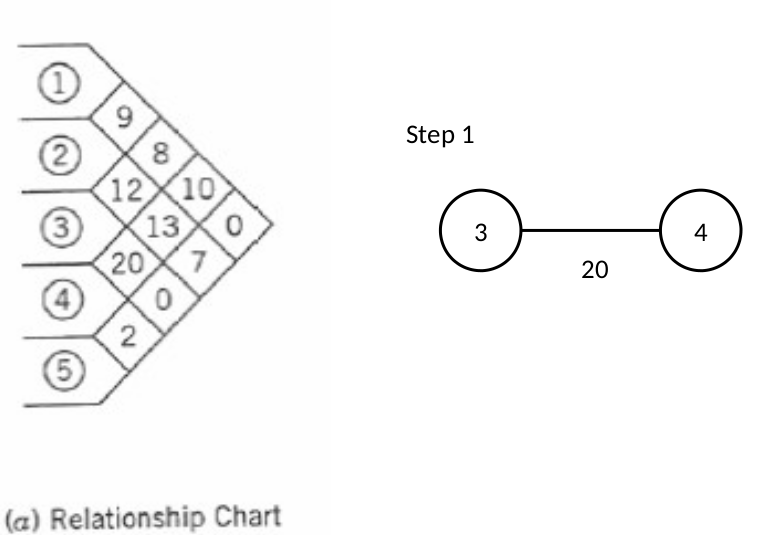
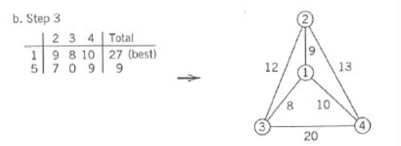
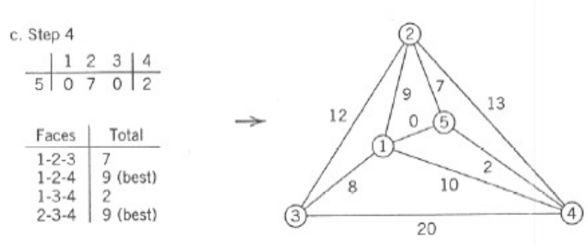
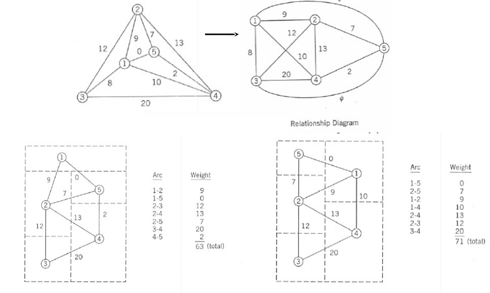

# Lecture 7 - Facility Layout Planning (cont.)

---

## Adjacency-Based Objective

Adjacency refers to elements sharing a common boundary. This method evaluates layouts based on adjacency weights.

### Objective Function
The evaluation relies on the weight of adjacency necessity, denoted as \( f_{i,j} \), and a factor \( x_{i,j} \), which determines if two blocks are adjacent.

The objective function \( z \) is calculated as:
\[
z = \sum \sum f_{i,j} x_{i,j}
\]

This function provides insight into the performance of the layout. The higher the value of \( z \), the better the layout.

**Normalization**: After calculating \( z \), normalization is applied as shown in the figure.

**Pros**: Provides a reference score where the best value is 1.

---

## Classification of Algorithms

### Based on Primary Function
1. **Construction-Based Algorithms**: Builds the layout from scratch.
2. **Improvement-Based Algorithms**: Focuses on refining an existing layout.

### Based on Layout Representation Format
1. **Discrete Format**: Areas are rounded to the nearest integer grid.
   
2. **Continuous Format**: Layouts are represented without grid constraints.
   

---

## Optimizing Layouts

The objective is to **minimize** or **maximize** \( z \) to reach an optimized (not ideal) layout.

### Techniques
#### 1. Graph-Based Method
- Relies on drawing relational graphs.
- Best suited for adjacency-based objectives.
- Consists of:
  * **Nodes**: Represent departments.
  * **Arcs**: Represent adjacency between departments.

**Key Constraints**:
- Maximum of four departments can be arranged.
- Graph arcs should not intersect.

---

### Example of Graph-Based Optimization
**Step-by-Step Process**:
1. **Choose initial departments**:
   * Select the two departments with the highest common value.  
   Example: Start with departments 3 and 4.  
   

2. **Create adjacency table**:
   * Illustrate values between selected departments (3 and 4) and others.  
   

3. **Iterate with additional departments**:
   * Include the next department in sequence and update the table.  
   

4. **Place the last department**:
   * Analyze where to position the fifth department relative to others.  
   * Use the same table-based analysis.  
   

5. **Adjust graph**:
   * Modify the graph to ensure it forms a rectangular layout while maintaining adjacency.  
   

