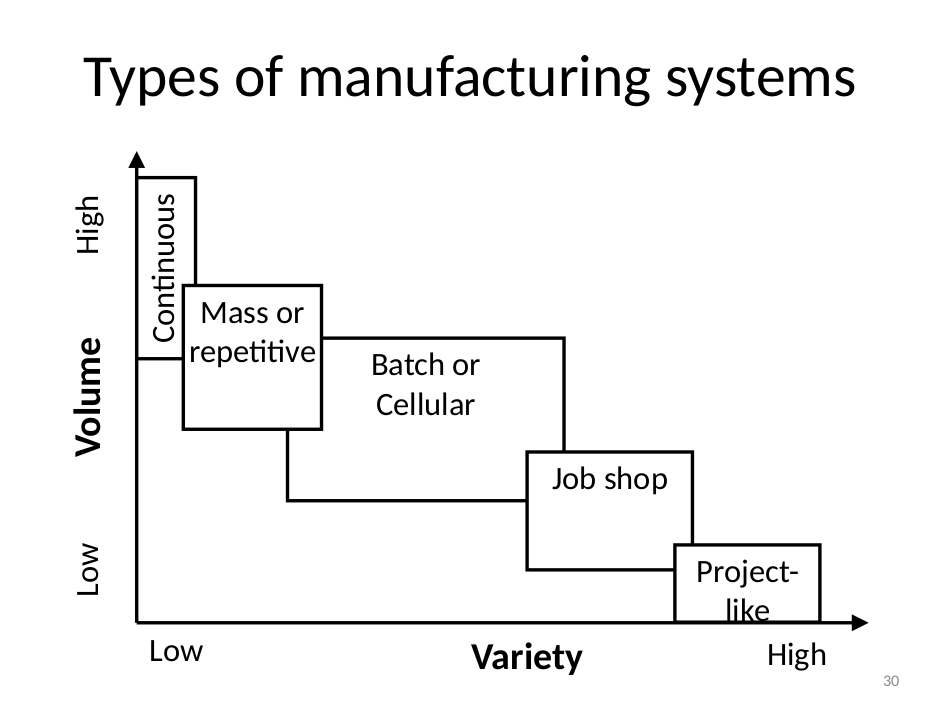

# Lecture 1 - Introduction 

* Classroom: gsshftx
* Software: [Sweethome3d](https://www.sweethome3d.com/)

## What is Production system

* It's a collection of workstations
* The workstation has differencet forms for example (assembly area, a machine that doeas something)

the production system as a consept is like a control system thta have inputs and gives outpus 

Input [materiial or workers or energy etc..] -> some of processes  [oprations, transformations, activitees]-> Outputs [goods of survices]
the element that the acts like a feed back in the contorol loop is the customers

## Design of production systems
 * it's a project itself

## Types of production system design projects

1. New facility
1. new production:
3. desing changes: changeing a current design
4. cost reduction: redesign a current project to reduce cost
5. Retrofit: design the new facility but with some contstarins like the small space

## Volume versus variety

we can classify the production systesms based on the variety and the volume of productions
* when the variety increases the more different products to produce but less volume of production
* the more volume of production the more autonmation of adaptiblity but will increase the production volume
example if asked the workshop in the collage to ask him to produce a bolts or any other component he will produce it in vary low low production rate
but if you want to produce only bolts you can use press machine you can produce alot of bolts in very short time but you can't produce any thing but bolts

"note" : search about something called cosuomized mass production to increae the variety and teh volume in the same time

## Types of manifacturing systems

* continouse production: usualy used in chimical reactions or ex: a factory that produce the steal rods(the production don't stop) (high volume and low variety)
* project like: it coustimize the product for each customer, etc the plan manufactring or ships (low volume high variety)
* mass or repettive
* job shop: a lot of general porpose machnines (like the colaage workshop)
* mass or repetitve: (like the car assembly line)
* batch or celluar:  like the clothes factoryies (it creates batchs and each batch with different design for example) it contains machine to produce a family of products

