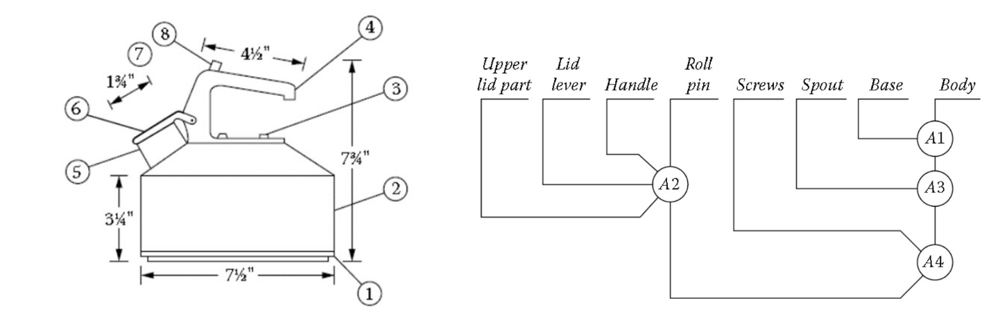
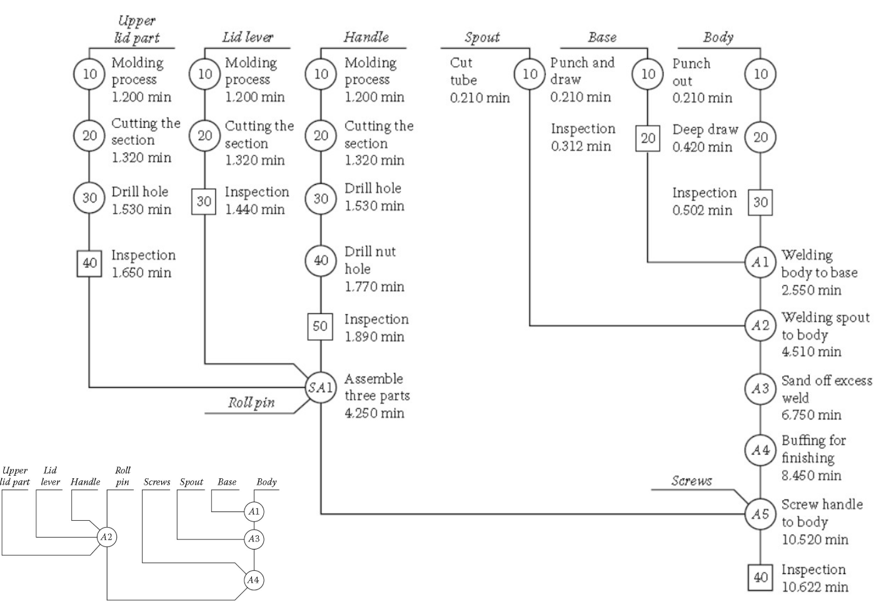
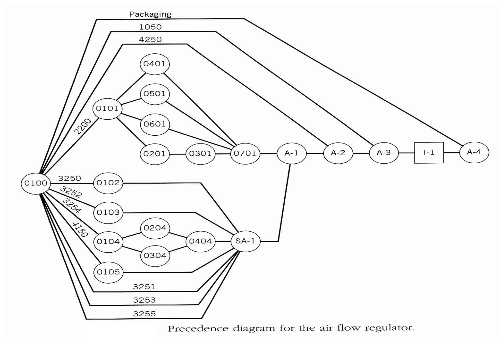

# Lecture 2 - Process Design

The process design is the phase of choosing the production method
we need to ask this question how will produce this product based on the veriety and the volume

example: if we don't need high voulume we might use the casting if we want low volume we can use press machine

in the process desgin we do the following:
* we chose the processes itself
* the sequence of the processes

we need to use the following tools:

## Prodct drawing

the product drasing is useful to extract the following information:
1. dimmentions
2. materila
3. fits and tolarance

what if we don't have the proddct drawing? we do reverse engineering

## Product assembly:
after having the assembly we do the following
they are represented by 
1. prod1. structure tree:
  * we use the drawing and we draw a floped tree and the head of this tree is the final product and we extact the sub assemblyies and then we do the same for the sub assemblies until we reach teh to the last level which contains the main components
  * the tree is represented by triangles containt the components and coded
  * the levels starts by 0 (the final producti) and the final level which is the the single part

2. bill of materials
  * it's like describing the produc structure tree in a table

## prodcution charts:

the charts are tool that describbe the productit contains some starnd symbols:
* O -> oprations
* -> -> transportation
* square -> inspection
* D -> delay
* flopped triangle -> storage

it include :
### 1. assembly chart
a production chart that shows the assembly oprations only example: 

it shows the prececessors of each assembly opration (what is depending on what)

### 2. opratin process chart

we use the assembly chart and add some additvie to it (the add the processes itself to the assebly chart)
esxample:

### 3. precedence chart

If we look at the ppration process chart we will notice that the dependciy of a process is not spicified it contain only a list
but in the precedence chart wee have to show the precedecne of the each process (it looks like the AON chart)
example:

## Time estimates:
why it shold be spicified: because some time we need to calculate the prodcution volume

methods:
* time study for manual oprations (trying and calculate)
* based on the experience and historical records (for old data)
* using the mechanicas of the process in case of automated systems (like we calculated in the metal cutting subject)
*  standard machine formulas (tables)

it's part of the process desing it should be spicified for each process we dscribe the movemetns for the oprators and we caclulate the time for each mvment and give some tolarance (this is called the time study)
example:

## Routing sheet

it descibes the following for each process:
* machines needed (tools) to be purrchesd
* estimated setup times for the machines
* productions in terms of the units/hour

note: the setup time is differnet from the opration time (the opration is th time of the orpation it self but the setup time maybe one time for a group of a the product)

## machine selciton 

To select machines, we need to know:
– Types of machines available for the required
manufacturing operations.
– Names of machine tool suppliers/sellers
– Range of costs
– Machine throughput and other technical data.
• Where can we obtain this information?
• How can we use it?

Online Equipment Sellers
• WWW is full of technical data provided by
equipment manufacturers.
• www.machinetools.com
• www.Alibaba.com
• www.haco.com/en

### Quick notes:
see the slides for the more details (you might need to search to understan everything)

#### Types of manufacturing processes

• Change material shape
• Machining part to a fixed dimension
• Obtain surface finish
• Join parts
• Change physical properties
• Plastic processing

#### Plastic Process (molding)
• Compression molding
• Injection molding
• Rotary molding
• Blow molding
• Extrusion
• Thermoforming

