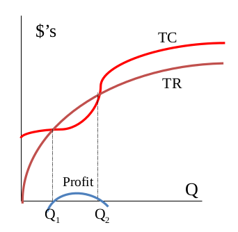

# Lecture  3- Make-or-Buy Decisions and Break-Even Analysis

## make-buy decition

fto decide ollow the following chart

### make or buy analysis:

cost elements in make decision
1. delivered purchased material costs
2. direect labor costs
3.inventrory carring costs
4. factory overhed costs

cost elements in the buy decision:
1. purchase price of the pat
2. transportains costs
3. receivint and inspetion costs
4.increamntal purchasin costs : for example to buy more then you need becaus you got offer
5. any follow on cost related to qualidty or survic

we use the variable and fixed costs when deciding to make or buy

## the brek even analysis

it helps to estimate which decision is batter
for example in the following tcharts (we total cost and total revinue
if the total revinue is higher then the total cost you will be getting progit)
the intercetion are the break even pointss
we do the ananlysis  for both if we bouaght or if we make
the x axis is the quentity and teh y axis the money

mostly we use the lineqaar braek even analysis as an asumption for a small range of output levels TR and TC
by assuming linearity we assume the following
 
 * constent selling price
 * consten marginal cost (the varlable csot)
 * firm produces only one product
 * no time lags between ivsetment and resultin revenue steam

using the lineaer assumption so we will have only one point intercetion in the bea graph

so using thease algebric analysis we can calculate teh 
i don't understand the following slides it will be uploead to chat gpt and chatgpt should add the explination with the same format stule as the rest of the file

for chat gpt please explain what is the PQ

## Related cocepts
* profit contribution = p - VC the amount per unit of sale contrubutes to fixed costs and profit
* target volume = (FC + profit_/(P- - VC)) the ouput at which a targeted total profit would be achived

## Enotes on xample : how many fanous ramada n need to be sold
* FC is the fixed cost
the profit is the target profit
the p is the slop of the brake even point
VC is teh varielbe cost

using the equation of target volume -= (fc + profit)/ (p-vc)
now you can get the volume that you need to sell to get the target profit
_________________________________________________________
complate  the rest of the lecture botes another time becaused انا خلاص مش قادر
