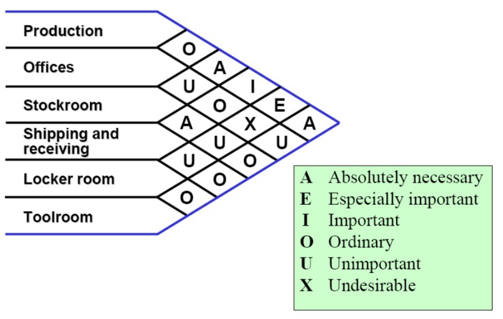
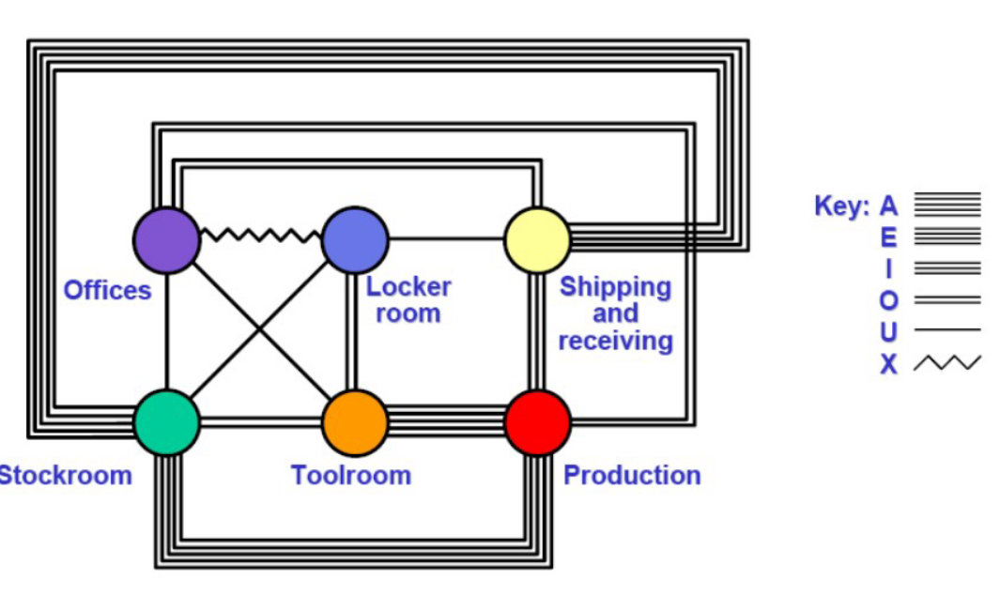
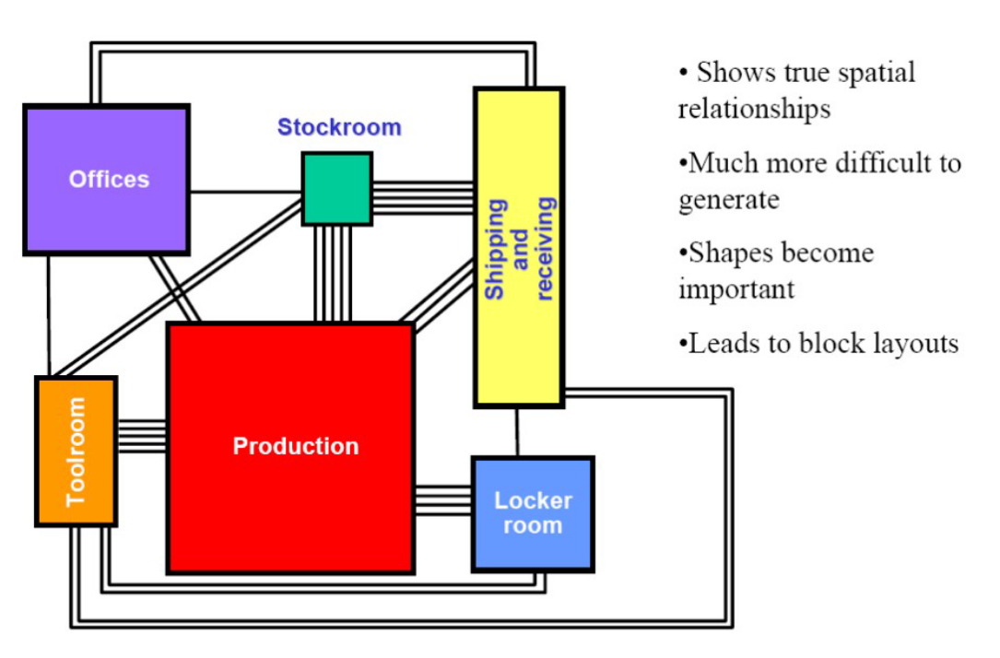
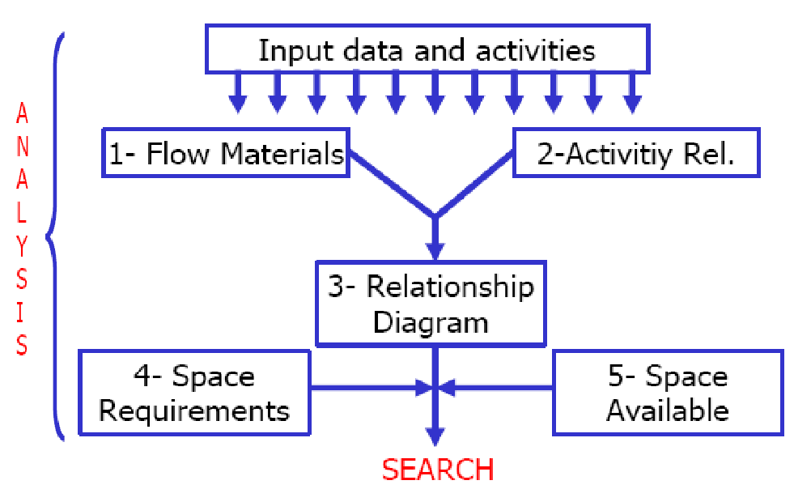
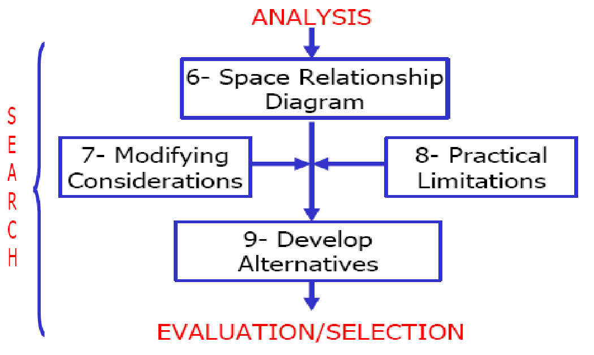

# Lecture 6 - Facility layout planning

## input data to facility layout planning

* selected type of production system
* available space for production system 
* selelcted machines and their numbers
* selected materila handling equipment and their numbers
* number of direct labors
* materila flow patterns
* material flow rates

## space requirements

it's the most difficult aspect of the planning because of the large amounts of uncertainity. like the following 
* the change of the technology which is unknown for the futrure expantion
* Demand forcasts: which changes all the time
* changing product mix 
* Parkinson's law: it' happens when giving more space to somethin.. this space will be used whatever needed or not so we need to design to be suitable for the workers movemetns and material handling
* new desgins

## design approach
we use it from bottom- up approach, it means starting with workspace design to the whole facility

### worksatation space design
we need to consider the following
1. equipment footprint:
  * machine travel
  * machine maintenace
  * plant services (what does it mean)
2. Material
  * inbound and store: the ways and the store space
  * in-process: where to but the material in process
  * Outbound: (what is it)
  * waste and scrap: make sure you make space for the west material
  * Tools and fixtures
3. personnal:
  * the oprator itself
  * materila handling
  * ingress/egress (what is it)

example:

### Departmental space area
we add the sisle allowneces to the sum of workstation areas. (we add the roads space)
it can be determentd based on the load maximum area that gets moved between the workspaces
it can be determined nearly from this table

we add the to the departmental sevice requieremtns sheet, whcin contains all the data related to each workstation (equip, matl, opr) and area adn then adding the aisle allowneces

### Aisle planning
it's used to promote the flow 
Types:
* Departmental aisles
* main aisles (what is the different between them)

Tradoff:
* Congestion VS wasted space
Principles:
* avoid curves and non-right angle intersetions (الكيفات تؤدي الى التوهان وفقدان القدرة على تحديد الانتباه)
* aisles shlud be straight and lead to doors (متعملهاش زي شوارع المعادي)
* avoid aisles along outer wall of bldg. unless for entry or exit (because it's considers a waste whcih you can use to serve other workstation)
* don't forget to consider column spacing (عواميد المبنى)

The width of the aisle is standard

### personnel space requirement

1. Employee/Facility Interface
2. Restrooms
3. Food Services
4. Health Services
5. Barrier-Free Compliance
6. Office Planning

example of this areas

## space relationship diagram:
1. start with the activity relationship chart

2. relation ship diagram
  * based on the neccesisty of the relations ships between the workspaces we express them with the number of parllael lines
  
  * after drawing them we strat to reorder the workcpace until it achives the requieremtns needd
  
  * after this starts to apply the areas to scale to the diagram
  

## Muther's systematic layout planning (SLP)
it descirps a systematic way to design the layout (initialized) instructied in the folloiwng flowchart

