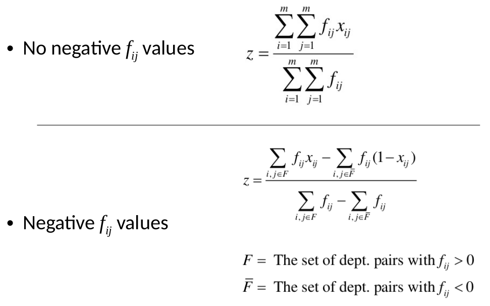
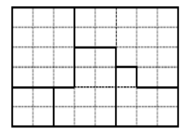
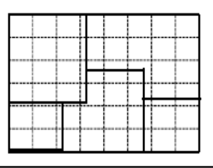
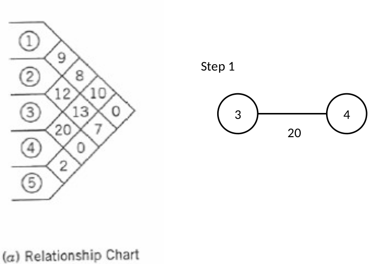
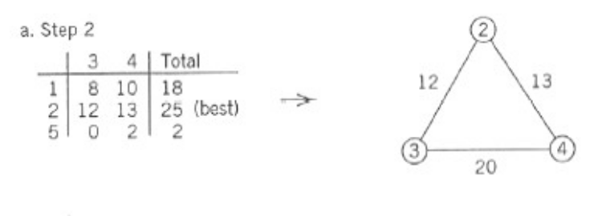
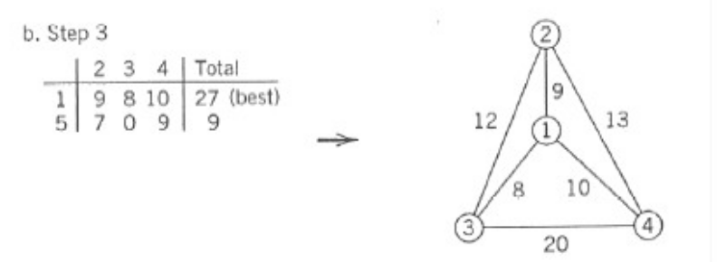
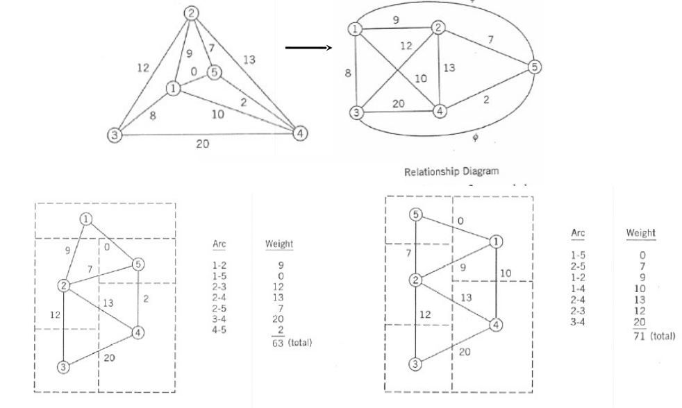

# Lecture 7 - Facility Layout Planning (cont.)

I didn't write until the page 9

## Adjacency based objective

adjacnt mean two things that has common boundries 

the evalution in this method is based on the $f_{i,j}$ where f is the waight of the neccesdry between the layouts and $x_{i,j} is a factor that determines if the the block is adjecent

we calculate the possible ovjective funtion $z$ which gives insights of the performacne

$z = \sum{\sum{f_{i,j} x_{i,j}}}$

then this is caculated intot hte following or normlaization

the more z the better

this method pros that it has a reference which 1 .

## classificatoin of algorithms - primeary funtion

* construction based: it builds the initial layout from tscratch

* improvemtn based: which imporves current laysout

## classifictiaon of algorthims - layout representaion format
* descre the area is arounded to the neardt integer number

* continouse: doeasn't use grid

## Optimizing layout
it's used to minimizee the z or maxmize it to reach the optimzed layout. not ideal

there is two techniques
### 1.graph based method
* t depends on the drawing grap like the realational out grpah
* it's used when useing adjacency based 
* in cosists of nodes and arcs:nodes are the departments, and arcs are the adhacent

the maximum number of departments can be done are only 4
also the the grpah arcs shlud not be intersected with each other

example:
Step 1: chose the realtion between the departmetns with higst common value and start with them (3, 4)

step 2: we cerate  atable as in the pictures to illstrate the histh values beteween 3 and 4 and others

step 3: itaratae as done in the last step but includeing the point

step 4: we put the last node (5th department ) between any other 2 deparments do the same table for the same analysis

step 5
now we have created the graph: start to adjast the graph to be adjasted to next others in eactugler shape 

### 2. pairwise exchange method

